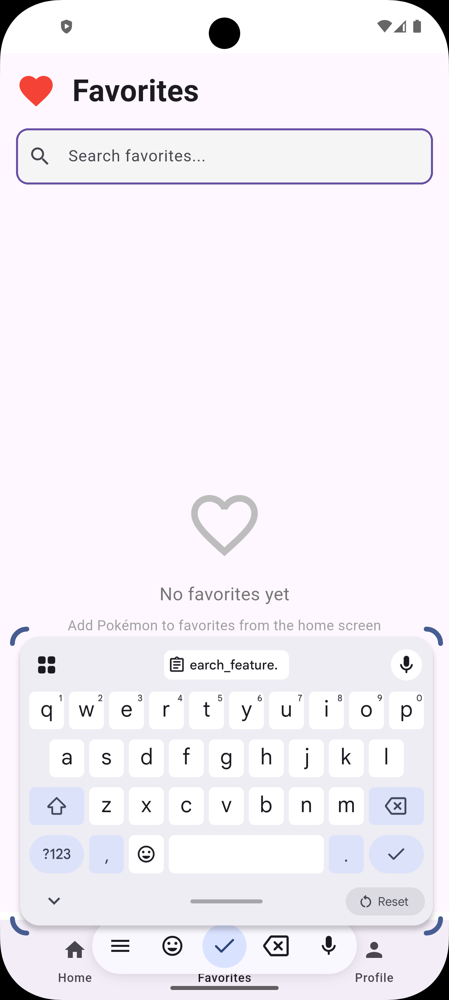

<div align="center">
  
</div>

<div align="center">
  
  
  <h1>Pokédex App</h1>
  
  <h3>Complete Pokémon Discovery & Collection System</h3>
  <p><em>Browse, search, and favorite your Pokémon with authentication, infinite scrolling, and beautiful light/dark mode UI</em></p>

  <p>
    
    
    
    
  </p>
</div>

---

A beautiful and modern Flutter application that allows users to browse, search,
and favorite Pokémon using the [PokeAPI](https://pokeapi.co/). Features Firebase
authentication with Google Sign-In, Cloud Firestore for persistent favorites,
infinite scroll pagination, responsive design, light/dark mode, and a clean
Material Design interface.

## Features ✨

- 🔐 **Firebase Authentication** - Secure user authentication with
  email/password and Google Sign-In
- 👤 **User Profiles** - Personalized profiles with Firebase user data
- 🔍 **Search Functionality** - Search for Pokémon by name or ID with real-time
  filtering and prefetching
- 📱 **Responsive UI** - Adaptive layouts for mobile, tablet, and desktop with
  Material Design
- 🌓 **Light/Dark Mode** - Beautiful theme switching with persistent preferences
- 🌐 **API Integration** - Fetches real-time Pokémon data from PokeAPI with
  parallel requests
- 🖼️ **High-Quality Images** - Displays official Pokémon artwork (PNG format)
- 📋 **Infinite Scroll** - Automatically loads more Pokémon as you scroll (50 at
  a time)
- ❤️ **Favorites System** - Add/remove Pokémon to favorites with Cloud Firestore
  persistence
- 🔎 **Favorites Search** - Search through your favorite Pokémon
- 📊 **Detailed Pokemon Info** - View stats, abilities, types, and evolution
  chains
- 🎯 **Optimized Performance** - Parallel API requests and in-memory caching for
  faster loading
- 💾 **Persistent Storage** - Cloud Firestore integration for cross-device
  favorites sync
- 🎨 **Beautiful Cards** - Pokémon cards with images, names, and formatted IDs
- 🧭 **Bottom Navigation** - Easy navigation between Home, Favorites, and
  Profile screens
- 📐 **Responsive Design** - Breakpoint-based responsive utilities for all screen
  sizes

## Project Structure 📁

The project follows a clean **MVVM architecture** with clear separation of concerns:

```
lib/
├── main.dart                      # App entry point with Firebase initialization
├── firebase_options.dart          # Firebase configuration
├── core/                          # Core application infrastructure
│   └── theme/                     # Theme management and styling
├── data/                          # Data layer
│   ├── models/                    # Data models (Pokemon, User, etc.)
│   ├── repositories/              # Repository pattern implementations
│   └── services/                  # External service integrations
│       ├── api/                   # PokeAPI integration
│       ├── firebase/              # Firebase services (Auth, Firestore)
│       └── local/                 # Local services (Cache, Storage)
├── presentation/                  # Presentation layer
│   ├── viewmodels/                # Business logic and state management
│   ├── screens/                   # Screen-level UI components
│   └── widgets/                   # Reusable UI widgets
└── utils/                         # Utility classes and helpers
    ├── constants/                 # App-wide constants
    └── responsive/                # Responsive design utilities
```

> **Note**: This is a high-level overview. For the complete file structure, explore the `lib/` directory.

## Technologies Used 🛠️

- **Flutter** - Cross-platform mobile framework
- **Dart** - Programming language
- **Firebase Auth** - User authentication and management
- **Firebase Core** - Firebase platform integration
- **Cloud Firestore** - Cloud database for favorites persistence
- **Google Sign-In** - OAuth authentication with Google
- **Provider** - State management solution
- **HTTP Package** - For API requests
- **PokeAPI** - RESTful Pokemon API

## Getting Started 🚀

### Prerequisites

- Flutter SDK (3.10.0 or higher)
- Dart SDK
- Android Studio / VS Code
- iOS Simulator / Android Emulator

### Installation

1. **Clone the repository**

   ```bash
   git clone https://github.com/itumelengseema/PokeHub.git
   cd PokeHub
   ```

2. **Install dependencies**

   ```bash
   flutter pub get
   ```

3. **Firebase Setup**

   - Create a Firebase project at
     [Firebase Console](https://console.firebase.google.com/)
   - Add an Android app to your Firebase project
   - Download `google-services.json` and place it in `android/app/`
   - Enable Email/Password and Google Sign-In in Authentication settings
   - Enable Cloud Firestore in your Firebase project for favorites persistence
   - Set up Firestore security rules (example below):
     ```
     rules_version = '2';
     service cloud.firestore {
       match /databases/{database}/documents {
         match /users/{userId}/favorites/{favoriteId} {
           allow read, write: if request.auth != null && request.auth.uid == userId;
         }
       }
     }
     ```
   - For Google Sign-In, add your SHA-1 fingerprint (see
     [GOOGLE_SIGNIN_SETUP.md](GOOGLE_SIGNIN_SETUP.md))

4. **Run the app**
   ```bash
   flutter run
   ```

## API Integration 🌐

The app uses the [PokeAPI](https://pokeapi.co/) to fetch Pokémon data:

- **Base URL**: `https://pokeapi.co/api/v2/pokemon/`
- **Endpoints Used**:
  - `/pokemon?offset={offset}&limit={limit}` - Fetch paginated list of Pokémon
  - `/pokemon/{id}/` - Fetch individual Pokémon details
- **Image Source**: Official artwork from
  `sprites.other.official-artwork.front_default`
- **Optimization**: Parallel API requests using `Future.wait()` for faster
  loading

## App Screenshots 📸

<p align="center">
  
  
  
</p>

<p align="center">
  
  
</p>


## Key Components 🔑

### Authentication System

- Email/password authentication with Firebase
- Google Sign-In integration with OAuth
- Password reset functionality
- Secure user session management
- Auth state wrapper for protected routes
- Clean modern login/signup UI with black theme

### Home Screen

- Displays Pokémon logo and branding
- Search bar for filtering Pokémon with prefetching
- Responsive grid view with infinite scroll
- Favorite buttons on each card
- Automatic pagination (loads 50 Pokémon at a time)
- Loading indicators for smooth UX
- ScrollController for detecting scroll position
- Light/dark mode support
- Adaptive layouts for different screen sizes

### Profile Screen

- Firebase user information display
- Theme toggle for light/dark mode
- Member since date
- Edit profile option (coming soon)
- Logout functionality with confirmation
- Modern card-based layout

### Details Screen

- Comprehensive Pokémon information
- Stats visualization with progress bars
- Types and abilities display
- Evolution chain with images
- Height and weight information
- Full light/dark mode support
- Dynamic color theming

### Favorites Screen

- Displays all favorited Pokémon from Cloud Firestore
- Search functionality to filter favorites
- Add/remove favorites with heart icon
- Real-time sync across devices
- Empty state with helpful messaging
- Real-time updates when favorites change
- Grid layout matching home screen
- Persistent storage with Firestore

### Pokémon Card Widget

- Reusable component with favorite functionality
- High-quality Pokémon images with error handling
- Formatted Pokémon ID (#001, #025, etc.)
- Capitalized Pokémon names
- Heart icon for favorites (filled when favorited)
- Smooth animations and interactions
- Responsive sizing for different screen sizes

### Responsive Design System

- Breakpoint-based layouts for mobile, tablet, and desktop
- Adaptive grids that adjust to screen size
- Responsive sizing utilities for consistent spacing
- Device type detection and orientation support

### State Management

- **Provider** for reactive state management
- **ViewModels** handle business logic and state
- Real-time updates with Firestore streams for favorites
- Persistent theme preferences

### Data Layer

- **Repository Pattern** abstracts data sources
- **API Services** handle PokeAPI integration with caching
- **Firebase Services** manage authentication and Firestore
- In-memory caching for improved performance

## Dependencies 📦

This project uses Flutter and Firebase for cross-platform development with cloud integration. Key dependencies include:

- **Flutter & Dart** - Cross-platform framework and programming language
- **Firebase** - Authentication (`firebase_auth`, `firebase_core`) and database (`cloud_firestore`)
- **Provider** - State management solution
- **HTTP** - API communication with PokeAPI
- **Google Sign-In** - OAuth authentication

> **For complete dependency list with versions**, see [`pubspec.yaml`](pubspec.yaml)

## Testing 🧪

The app is designed with testability in mind, using dependency injection and repository patterns to facilitate unit and widget testing.

### Test Architecture

- **Repository Pattern**: Abstracts data sources for easy mocking
- **Dependency Injection**: Services can be injected for testing
- **Provider State Management**: Testable state management solution
- **Mockito**: Support for mocking HTTP clients and services

### Running Tests

```bash
# Run all tests
flutter test

# Run tests with coverage
flutter test --coverage

# Run specific test file
flutter test test/[test_file_name]_test.dart
```

### Testable Components

- **ViewModels**: Business logic with injected repositories
- **Repositories**: Data layer with injected services
- **Widgets**: UI components with mock data
- **Services**: API and Firebase services with mocked responses

## Development 💻

### Architecture Pattern

- **MVVM Pattern**: Separation of Views, ViewModels, and Models with
  data binding
- **Repository Pattern**: Abstract data layer for flexible data sources
- **State Management**: Provider for reactive state management
- **Firebase Integration**: Authentication and Cloud Firestore for data
  persistence
- **Service Layer**: Abstracted API, authentication, and cache services
- **Widget Composition**: Reusable, modular widgets
- **Auth Wrapper**: Stream-based authentication state management
- **Responsive Design**: Breakpoint-based responsive utilities
- **Dependency Injection**: Constructor injection for testability

### Adding New Features

The project follows a layered architecture. To add new features:

1. **Models** - Define data structures in `lib/data/models/`
2. **Services** - Implement external integrations in `lib/data/services/`
3. **Repositories** - Create data access layer in `lib/data/repositories/`
4. **ViewModels** - Add business logic in `lib/presentation/viewmodels/`
5. **UI** - Build screens and widgets in `lib/presentation/`
6. **State Management** - Use Provider for reactive updates
7. **Testing** - Write unit/widget tests for new functionality
8. **Responsive Design** - Utilize responsive utilities for all screen sizes

> **Tip**: Follow existing patterns in the codebase to maintain consistency.

### Performance Optimizations

- Parallel API requests reduce loading time by ~10x
- In-memory caching with CacheService reduces redundant API calls
- Infinite scroll loads data on-demand (50 items per batch)
- Image caching for faster subsequent loads
- Efficient list rendering with GridView.builder
- Optimized widget rebuilds with Provider
- Prefetching for smoother user experience
- Repository pattern minimizes direct API dependencies


## Acknowledgments 🙏

- [PokeAPI](https://pokeapi.co/) for providing the Pokemon data
- [Firebase](https://firebase.google.com/) for authentication services
- Flutter team for the amazing framework
- Pokemon Company for the wonderful Pokemon universe

## Contact 📧

**Itumeleng Seema**

- GitHub: [@itumelengseema](https://github.com/itumelengseema)

---

## Maintaining This Documentation 📝

To keep this README accurate and useful:

- **Dependencies**: Check [`pubspec.yaml`](pubspec.yaml) for current versions
- **Project Structure**: Explore the `lib/` directory for the latest file organization
- **Features**: Update this document when adding/removing major features
- **Screenshots**: Update screenshots when UI changes significantly

This ensures new contributors always have accurate, up-to-date information.

