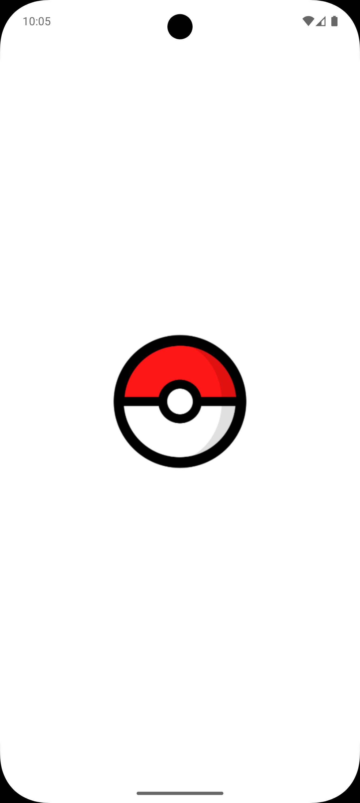
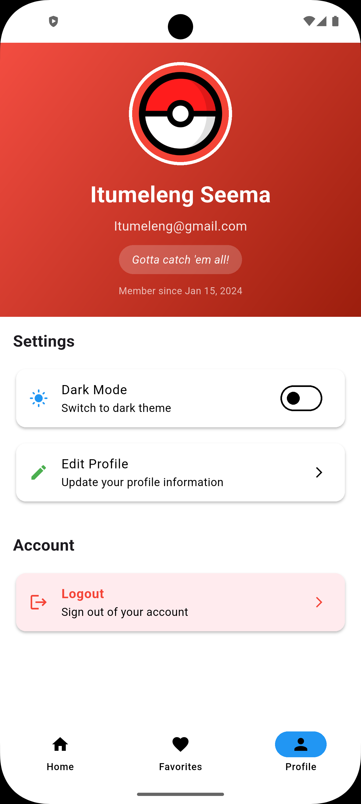

<div align="center">
  
</div>

<div align="center">
  
  
  <h1>Pokédex App</h1>
  
  <h3>Complete Pokémon Discovery & Collection System</h3>
  <p><em>Browse, search, and favorite your Pokémon with infinite scrolling and beautiful UI</em></p>

  <p>
    
    
    
  </p>
</div>

---

A beautiful and modern Flutter application that allows users to browse, search, and favorite Pokémon using the [PokeAPI](https://pokeapi.co/). Features infinite scroll pagination, favorites management, and a clean Material Design interface.

## Features ✨

- 🔍 **Search Functionality** - Search for Pokémon by name or ID with real-time filtering
- 📱 **Responsive UI** - Clean and modern Material Design interface with grid layout
- 🌐 **API Integration** - Fetches real-time Pokémon data from PokeAPI with parallel requests
- 🖼️ **High-Quality Images** - Displays official Pokémon artwork (PNG format)
- 📋 **Infinite Scroll** - Automatically loads more Pokémon as you scroll (20 at a time)
- ❤️ **Favorites System** - Add/remove Pokémon to favorites with persistent state
- 🔎 **Favorites Search** - Search through your favorite Pokémon
- 🎯 **Optimized Performance** - Parallel API requests for faster loading
- 🎨 **Beautiful Cards** - Pokémon cards with images, names, and formatted IDs
- 🧭 **Bottom Navigation** - Easy navigation between Home, Favorites, and Profile screens

## Project Structure 📁

```
lib/
├── main.dart                      # App entry point with navigation
├── models/
│   ├── pokemon.dart              # Pokemon data model with equality methods
│   ├── pokemon_detail.dart       # Detailed Pokemon information model
│   └── user_profile.dart         # User profile model
├── controllers/
│   ├── pokemon_controller.dart   # Pokemon fetching logic
│   ├── favorites_controller.dart # Favorites management with ChangeNotifier
│   └── theme_controller.dart     # Theme management
├── services/
│   └── api_services.dart         # API service with parallel requests
└── views/
    ├── screens/
    │   ├── home_screen.dart      # Main screen with infinite scroll
    │   ├── favorites_screen.dart # Favorites management screen
    │   └── details_screen.dart   # Pokemon detail view
    └── widgets/
        ├── search_bar.dart       # Custom search bar widget
        └── pokemon_card.dart     # Reusable Pokemon card with favorite button
```

## Technologies Used 🛠️

- **Flutter** - Cross-platform mobile framework
- **Dart** - Programming language
- **HTTP Package** - For API requests
- **PokeAPI** - RESTful Pokemon API

## Getting Started 🚀

### Prerequisites

- Flutter SDK (3.10.0 or higher)
- Dart SDK
- Android Studio / VS Code
- iOS Simulator / Android Emulator

### Installation

1. **Clone the repository**

   ```bash
   git clone https://github.com/itumelengseema/pokedex_app.git
   cd pokedex_app
   ```

2. **Install dependencies**

   ```bash
   flutter pub get
   ```

3. **Run the app**
   ```bash
   flutter run
   ```

## API Integration 🌐

The app uses the [PokeAPI](https://pokeapi.co/) to fetch Pokémon data:

- **Base URL**: `https://pokeapi.co/api/v2/pokemon/`
- **Endpoints Used**:
  - `/pokemon?offset={offset}&limit={limit}` - Fetch paginated list of Pokémon
  - `/pokemon/{id}/` - Fetch individual Pokémon details
- **Image Source**: Official artwork from `sprites.other.official-artwork.front_default`
- **Optimization**: Parallel API requests using `Future.wait()` for faster loading

## App Screenshots 📸

<p align="center">
  
  
  
  
  
</p>


## Key Components 🔑

### Home Screen
- Displays Pokémon logo and branding
- Search bar for filtering Pokémon
- 2-column grid view with infinite scroll
- Favorite buttons on each card
- Automatic pagination (loads 20 Pokémon at a time)
- Loading indicators for smooth UX
- ScrollController for detecting scroll position

### Favorites Screen
- Displays all favorited Pokémon
- Search functionality to filter favorites
- Add/remove favorites with heart icon
- Empty state with helpful messaging
- Real-time updates when favorites change
- Grid layout matching home screen

### Pokémon Card Widget
- Reusable component with favorite functionality
- High-quality Pokémon images with error handling
- Formatted Pokémon ID (#001, #025, etc.)
- Capitalized Pokémon names
- Heart icon for favorites (filled when favorited)
- Smooth animations and interactions

### Favorites Controller
- ChangeNotifier for state management
- Add/remove/toggle favorites
- Search favorites by name or ID
- Persistent favorites list
- Notifies listeners on changes

### API Services
- Parallel HTTP requests for performance
- Handles pagination with offset/limit
- Parses JSON responses efficiently
- Error handling with fallbacks
- Fetches high-quality PNG artwork
- Graceful degradation if images fail

## Dependencies 📦

```yaml
dependencies:
  flutter:
    sdk: flutter
  http: ^1.6.0           # For API requests
  cupertino_icons: ^1.0.8 # iOS icons
```

## Development 💻

### Architecture Pattern
- **MVC Pattern**: Separation of Models, Views, and Controllers
- **State Management**: ChangeNotifier for favorites
- **Widget Composition**: Reusable, modular widgets
- **Service Layer**: Abstracted API calls

### Adding New Features

1. Create new widgets in `lib/views/widgets/`
2. Add business logic to `lib/controllers/`
3. Update models in `lib/models/` if needed
4. Integrate API calls through `lib/services/api_services.dart`

### Performance Optimizations
- Parallel API requests reduce loading time by ~10x
- Infinite scroll loads data on-demand
- Image caching for faster subsequent loads
- Efficient list rendering with GridView.builder

### Code Style

- Follow Flutter's official style guide
- Use meaningful variable and function names
- Add comments for complex logic
- Keep widgets small and reusable
- Implement proper error handling

## Future Enhancements 🚀

- [x] Infinite scroll pagination
- [x] Favorites system with persistence
- [x] Search favorites functionality
- [x] High-quality Pokémon images
- [x] Optimized API calls with parallel requests
- [ ] 🔐 **Authentication** - User accounts and cloud sync (Planned)
- [ ] Pokémon detail page with stats, abilities, and evolutions
- [ ] Filter by type, generation, region
- [ ] Offline caching with local database
- [ ] Dark mode support
- [ ] Pokémon comparison feature
- [ ] Advanced search filters (by stats, type, etc.)
- [ ] Share favorite Pokémon
- [ ] Animated Pokémon sprites
- [ ] Sound effects and haptic feedback

## Contributing 🤝

Contributions are welcome! Please feel free to submit a Pull Request.

1. Fork the project
2. Create your feature branch (`git checkout -b feature/AmazingFeature`)
3. Commit your changes (`git commit -m 'Add some AmazingFeature'`)
4. Push to the branch (`git push origin feature/AmazingFeature`)
5. Open a Pull Request

## License 📄

This project is licensed under the MIT License - see the LICENSE file for
details.

## Acknowledgments 🙏

- [PokeAPI](https://pokeapi.co/) for providing the Pokemon data
- Flutter team for the amazing framework
- Pokemon Company for the wonderful Pokemon universe

## Contact 📧

**Itumeleng Seema**

- GitHub: [@itumelengseema](https://github.com/itumelengseema)

---
