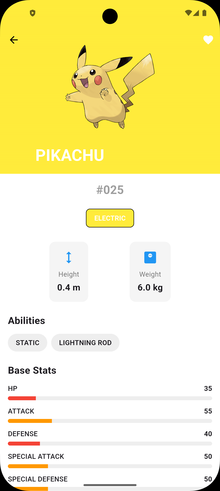

<p align="center">
  
  
</p>

<div style="display:flex; align-items:center; gap:12px;">
    
    <h1 style="margin:0;">Pokedex App </h1>
</div>

A beautiful and modern Flutter application that allows users to browse and
search Pokemon using the [PokeAPI](https://pokeapi.co/).

## Features ✨

- 🔍 **Search Functionality** - Search for Pokemon by name with a clean,
  intuitive search bar
- 📱 **Responsive UI** - Clean and modern Material Design interface
- 🌐 **API Integration** - Fetches real-time Pokemon data from PokeAPI
- 🖼️ **Pokemon Images** - Displays Pokemon sprites and artwork
- 📋 **Pokemon List** - Browse through a comprehensive list of Pokemon

## Project Structure 📁

```
lib/
├── main.dart                 # App entry point
├── models/
│   └── pokemon.dart         # Pokemon data model
├── controllers/
│   └── pokemon_controller.dart  # Business logic layer
├── services/
│   └── api_services.dart    # API service for PokeAPI integration
└── views/
    ├── screens/
    │   └── home_screen.dart # Main home screen
    └── widgets/
        ├── search_bar.dart  # Custom search bar widget
        └── pokemon_card.dart # Pokemon card widget
```

## Technologies Used 🛠️

- **Flutter** - Cross-platform mobile framework
- **Dart** - Programming language
- **HTTP Package** - For API requests
- **PokeAPI** - RESTful Pokemon API

## Getting Started 🚀

### Prerequisites

- Flutter SDK (3.10.0 or higher)
- Dart SDK
- Android Studio / VS Code
- iOS Simulator / Android Emulator

### Installation

1. **Clone the repository**

   ```bash
   git clone https://github.com/itumelengseema/pokedex_app.git
   cd pokedex_app
   ```

2. **Install dependencies**

   ```bash
   flutter pub get
   ```

3. **Run the app**
   ```bash
   flutter run
   ```

## API Integration 🌐

The app uses the [PokeAPI](https://pokeapi.co/) to fetch Pokemon data:

- **Base URL**: `https://pokeapi.co/api/v2/pokemon/`
- **Endpoints Used**:
  - `/pokemon?offset={offset}&limit={limit}` - Fetch list of Pokemon
  - `/pokemon/{id}/` - Fetch individual Pokemon details

## App Screenshots 📸

<p align="center">
  
  
  
</p>

<p align="center">
  
  
</p>

<!-- > **Note:** Add your app screenshots to the `assests/screenshots/` folder with
> the names:
>
> - `home_screen.png` - Main home screen with logo and search bar
> - `search_feature.png` - Search functionality in action
> - `pokemon_list.png` - Pokemon list/grid view
> - `pokemon_detail.png` - Individual Pokemon details (if implemented)
> - `loading_state.png` - Loading state of the app -->

## Key Components 🔑

### Home Screen

- Displays Pokemon logo
- Search bar for filtering Pokemon
- Pokemon list/grid view

### Search Bar

- Custom Flutter widget
- OutlineInputBorder styling
- Integrated search button
- On-screen keyboard support

### API Services

- Handles HTTP requests
- Parses JSON responses
- Error handling for failed requests
- Fetches Pokemon sprites and details

## Dependencies 📦

```yaml
dependencies:
  flutter:
    sdk: flutter
  http: ^1.6.0
```

## Development 💻

### Adding New Features

1. Create new widgets in `lib/views/widgets/`
2. Add business logic to `lib/controllers/`
3. Update models in `lib/models/` if needed
4. Integrate API calls through `lib/services/api_services.dart`

### Code Style

- Follow Flutter's official style guide
- Use meaningful variable and function names
- Add comments for complex logic
- Keep widgets small and reusable

## Future Enhancements 🚀

- [ ] Pokemon detail page with stats
- [ ] Favorite Pokemon feature
- [ ] Filter by type, generation, etc.
- [ ] Offline caching
- [ ] Dark mode support
- [ ] Pokemon comparison feature
- [ ] Advanced search filters

## Contributing 🤝

Contributions are welcome! Please feel free to submit a Pull Request.

1. Fork the project
2. Create your feature branch (`git checkout -b feature/AmazingFeature`)
3. Commit your changes (`git commit -m 'Add some AmazingFeature'`)
4. Push to the branch (`git push origin feature/AmazingFeature`)
5. Open a Pull Request

## License 📄

This project is licensed under the MIT License - see the LICENSE file for
details.

## Acknowledgments 🙏

- [PokeAPI](https://pokeapi.co/) for providing the Pokemon data
- Flutter team for the amazing framework
- Pokemon Company for the wonderful Pokemon universe

## Contact 📧

**Itumeleng Seema**

- GitHub: [@itumelengseema](https://github.com/itumelengseema)

---
